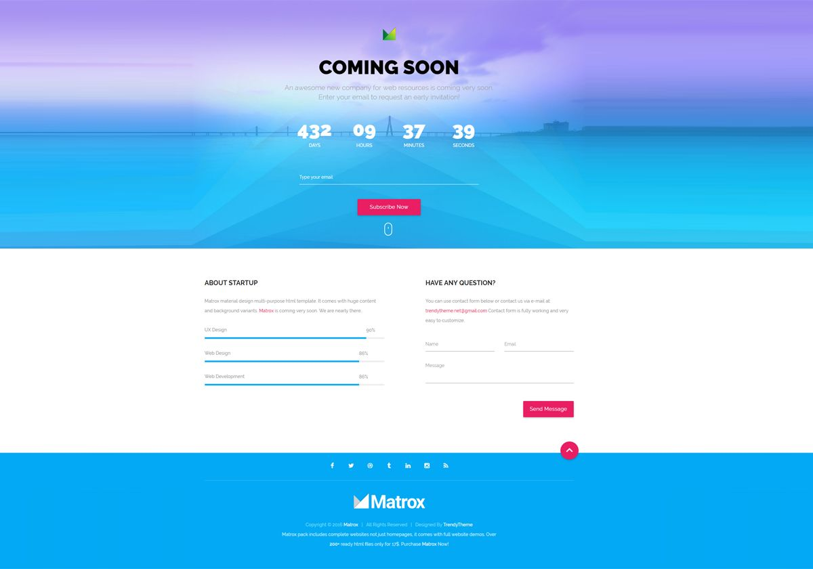

LICENSE Gluten Status Eco Status Discord

Coming soon
website design project

🌟 About
This project is for educational porpuses only. Pull request are welcome, but priority for project authors! Thank you for your cooperation!

Site published at: https://front-end-by-sberzonskiene.github.io/55-coming-soon

Design: 

🎯 Project features/goals:
-Github pages
-responsive design
-CSS file (components)
-external fonts
-CSS animations
-HTML forms
-background image
-Css custom properties (aka variables)

🧰 Getting Started

💻 Prerequisites
Node.js - download and install

https://nodejs.org
Git - download and install

https://git-scm.com

🏃 Run locally
Would like to run this project locally? Open terminal and follow these steps:

1. Clone the repo
   git clone https://github.com/front-end-by-sberzonskiene/55-coming-soon.git
2. Install NPM packages
   npm i
or
   npm install
3. Run the server
   npm run dev
   
🧪 Running tests
There is no tests for this project.

Authors
sberzonskiene: Github

⚠️ License

🔗 Other resources
No other resources.